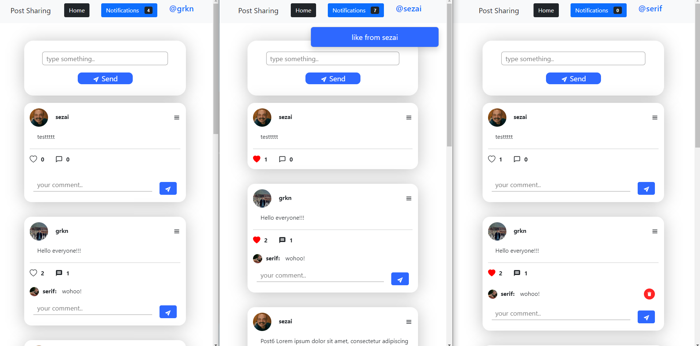

# Post Sharing with Push Notifs - Frontend

### Used Packages

**EventSource:** builtin package

**Bootstrap**: ui package

**React Icons**: icon

### How to run

#### clone the project: https://github.com/gurkanucar/post-sharing-fe

```bash
  git clone https://github.com/gurkanucar/post-sharing-fe
  cd post-sharing-fe
```

#### create jar

```bash
  npm install
```

#### build docker-compose

```bash
  npm start
```

## Example Images



### Example Video:

[https://www.youtube.com/watch?v=mqDtfS2quto](https://www.youtube.com/watch?v=mqDtfS2quto)

### Backend:

[https://github.com/gurkanucar/post-sharing-be](https://github.com/gurkanucar/post-sharing-be)
